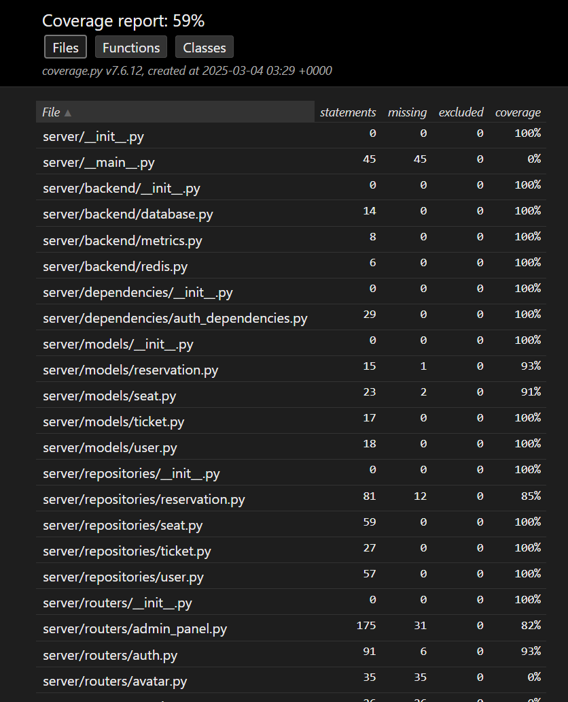
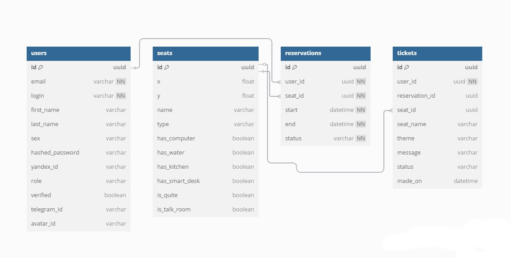
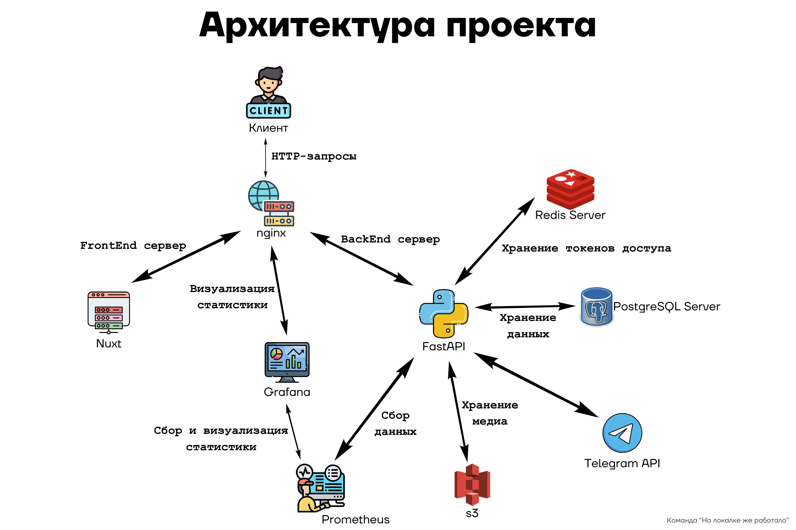
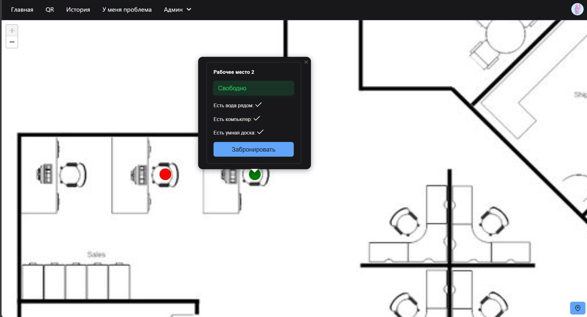
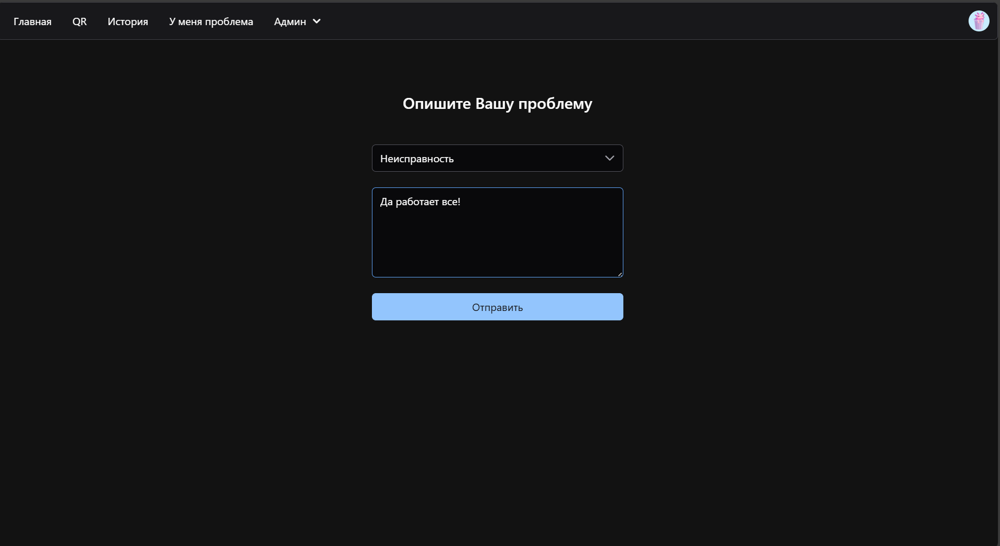
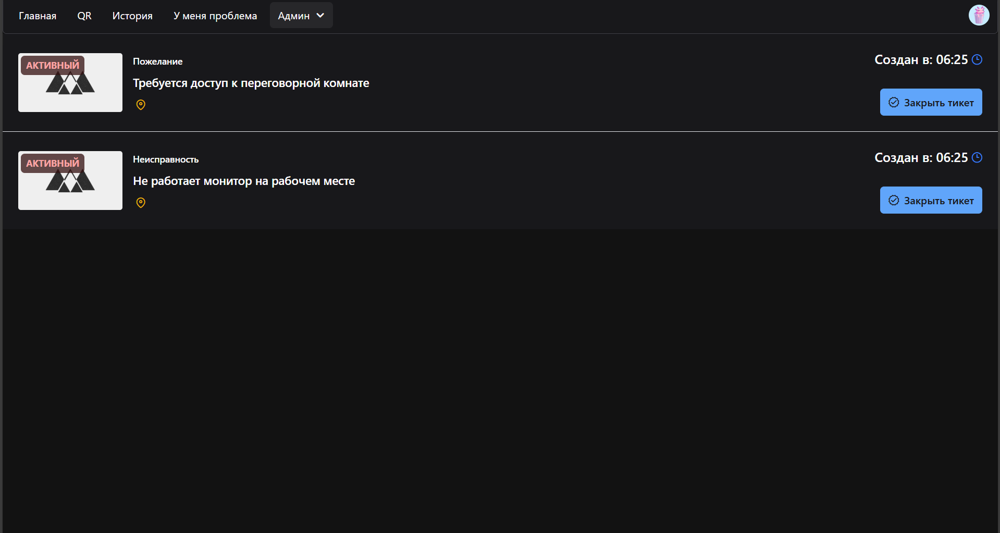
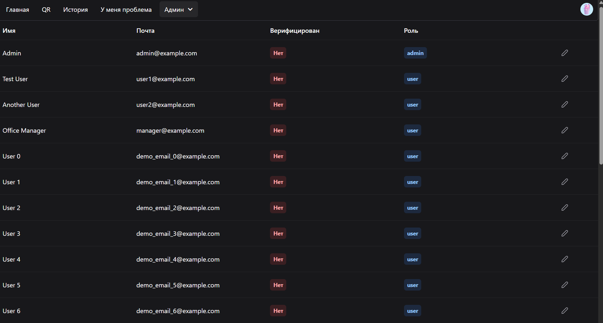
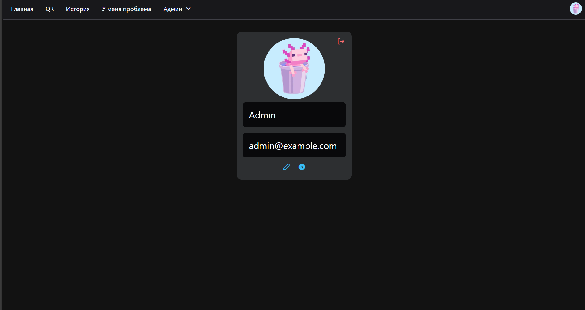
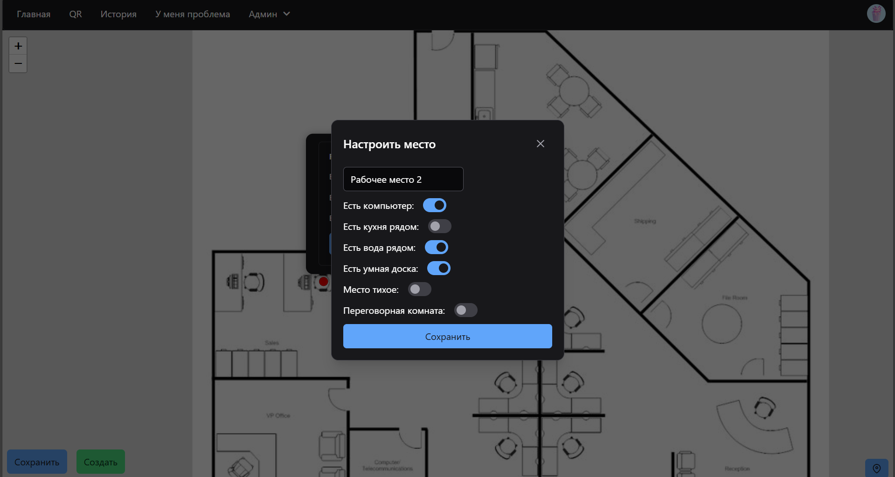

# BookIT

БЭКЕНД: https://gitlab.prodcontest.ru/team-17/lokalkateambackend

ФРОНТЭНД: https://gitlab.prodcontest.ru/team-17/lokalkaTeam-frontend

<hr>

### Бронь мест в коворкинге в пару кликов!

Данный проект реализует backend часть веб-сайта с использованием фреймворка [FastAPI](https://fastapi.tiangolo.com/). 
Приложение предоставляет собой REST API для работы с пользователями, бронированиями, тикетами, аватарами, а также 
административный функционал. Кроме того, проект включает интеграцию с внешними сервисами, такими как Telegram и 
Яндекс OAuth, а также сбор и экспорт метрик через Prometheus и Grafana.

<hr>

## Обзор

Проект представляет собой масштабируемую backend систему, построенную на FastAPI. Основной функционал включает:
- Регистрацию, авторизацию и управление пользователями (с использованием JWT и куки).
- Управление бронированиями и тикетами.
- Административный контроль (верификация пользователей, управление бронированиями, обновление статусов тикетов и т.д.).
- Интеграцию с внешними сервисами: Telegram, Яндекс OAuth.
- Сбор и визуализацию метрик с помощью Prometheus и Grafana.
- Хранение файлов (например, аватаров) через S3-совместимый сервис (MinIO).

<hr>

## Функциональные возможности

- **Пользователи:** регистрация и авторизация, обновление профиля, удаление аккаунта.
- **Бронирования:** создание, изменение, удаление и получение бронирований.
- **Тикеты:** создание тикетов пользователями и обработка их статусом администраторов.
- **Администрирование:** верификация пользователей, управление бронированиями, тикетами, местами и аватарами.
- **Интеграции:** подключение Telegram-бота и авторизация через Яндекс OAuth.
- **Мониторинг:** сбор метрик и их визуализация через Prometheus и Grafana.

<hr>

## Стек технологий

- Язык: **Python 3.12**
- Фреймворк для создания REST API: **FastAPI**
- ORM для работы с БД: **SQLAlchemy 2.0+ (асинхронная версия)**
- СУБД: **PostgreSQL**
- Кеширование и хранение токенов: **Redis**
- Аутентификация и авторизация: **JWT**
- Модуль для работы с внешними API: **aiohttp**
- Сбор и визуализация метрик: **Prometheus & Grafana**
- Хранение медиафайлов (аватаров): **MinIO (S3)**
- Контейнеризация и оркестрация сервисов: **Docker & Docker Compose**

<hr>

## Запуск проекта
1. Клонируйте репозиторий
2. `.env.example` переименуйте в `.env`
3. Поменяйте значение `ENV_TYPE` в .env в зависимости от ваших нужд (`local` - локальный запуск, `test` - запуск тестов, `server` - деплой на сервер)
4. Пропишите команду в консоль `docker compose up --build`
5. Отправьте `POST` запрос по адресу `http://0.0.0.0:8010/start_bot` внутри хоста, чтобы запустить телеграм-бота (CI/CD делает это автоматически)
6. Спецификация (Swagger): `https://prod-team-17-61ojpp1i.final.prodcontest.ru/api/docs`
7. Для подключения к `Grafana` (по url `/grafana`) используйте логин `admin` и пароль `prod_2025`. POST Эндпоинт для симуляции метрик (в целях демо): `/api/simulation/control`

<hr>

## Конфигурация
- **База данных:** Используется асинхронная SQLAlchemy для работы с PostgreSQL. Настройки подключения определяются в файле `server/backend/database.py`
- **Redis:** Клиент Redis используется для хранения токенов и кеширования. Конфигурация описана в `server/backend/redis.py`
- **JWT:** Создание и проверка токенов реализованы в сервисе `server/services/auth.py`
- **Хранение файлов:** Для хранения изображений используется сервис, совместимый с S3 (MinIO). Конфигурация задаётся через переменные `S3_ACCESS_KEY` и `S3_SECRET_KEY`
- **Интеграции:** Для Telegram и Яндекс OAuth задействованы отдельные сервисы и роуты, которые используют настройки из переменных окружения
- **Метрики:** Prometheus собирает метрики, а Grafana позволяет визуализировать данные

<hr>

## Тестирование проекта
У юнит тестов покрытие 60%. Основные сценарии взаимодействия фронта с беком протестированы в е2е

У вас должна в .env стоять ENV_TYPE=test
- **e2e тесты:** в директории `test/api_tests` - e2e тесты для пользователей, мест, броней и тикетов
- **unit тесты:** в директории `test/unit_tests` - unit тесты 

Чтобы запустить тесты, необходимо сделать 2 шага:
1. Установить переменную окружения в .env `ENV_TYPE=test`
2. Запустить `./test/test.sh` или `./test/unit_test.sh` (из корян проекта) в зависимости от нужного типа тестов. `unit_test.sh` нужно запускать внутри контейнера,
а `test.sh` - на хосте




<hr>

## API

Краткий обзор основных эндпоинтов:

### Административные эндпоинты (`api/admin`)

1. Проверка QR-кода брони: `POST api/admin/check_qr/{reservation_id}`
2. Верификация пользователя: `POST api/admin/verify_user/{user_id}`
3. Удаление, создание и редактирование бронирований: `DELETE api/admin/reservation/{reservation_id}`, `POST api/admin/reservation/create`, `PATCH api/admin/reservation/{reservation_id}`
4. Получение всех броней, тикетов и пользователей: `GET api/admin/reservations`, `GET api/admin/tickets`, `GET api/admin/users`
5. Обновление статуса тикета: `PATCH api/admin/ticket/{ticket_id}/status`
6. Загрузка аватара по умолчанию: `POST api/admin/default_avatar`

### Аутентификация (`api/auth`)

1. Регистрация пользователя: `POST api/auth/register`
2. Авторизация (логин): `POST api/auth/login`
3. Обновление токенов: `POST api/auth/refresh`
4. Выход из аккаунта: `POST api/auth/logout`

### Аватар (`api/avatar`)

1. Загрузка нового аватара: `POST api/avatar/upload`
2. Получение аватара: `GET api/avatar`

### Бронирования и тикеты (`api/reservations`, `api/ticket`)

1. Создание, редактирование и получение бронирований: `POST api/reservations`, `GET api/reservations`, `GET api/reservations/{reservation_id}`, `PATCH api/reservations/{reservation_id}`
2. Создание тикета: `POST api/ticket`
3. Получение тикетов пользователя: `GET api/ticket/my`

### Места в коворкинге (`api/seat`)

1. Создание, редактирование и удаление мест: `POST api/seat`, `PATCH api/seat/{seat_id}`, `DELETE api/seat/{seat_id}`
2. Получение информации о месте и списка мест по временным промежуткам: `GET api/seat/{seat_id}`, `GET api/seat?start={start}&end={end}`

### Интеграция с Telegram (`api/telegram`)

1. Получение токена для подключения Telegram: `GET api/telegram/get_token`
2. Подключение Telegram аккаунта: `POST api/telegram/connect`
3. Проверка существования пользователя по Telegram ID: `GET api/telegram/exists`

### Яндекс OAuth (`api/yandex`)

1. Вход через Яндекс: `GET api/yandex/login`
2. Callback Яндекс OAuth: `GET api/yandex/callback`

<hr>

## Структура проекта

```plaintext
server/
├── backend/
│   ├── database.py         # Настройка подключения к базе данных
│   ├── redis.py            # Клиент Redis
│   └── metrics.py          # Метрики Prometheus
├── dependencies/
│   └── auth_dependencies.py# Зависимости для аутентификации
├── models/
│   ├── user.py             # Модель пользователя
│   ├── reservation.py      # Модель бронирования
│   ├── seat.py             # Модель мест
│   └── ...                 # Другие модели
├── repositories/
│   ├── user.py             # Логика работы с пользователями
│   ├── reservation.py      # Логика работы с бронированиями
│   ├── ticket.py           # Логика работы с тикетами
│   └── seat.py             # Логика работы с местами
├── schemas/
│   ├── user.py             # Схемы для пользователей
│   ├── reservation.py      # Схемы для бронирований
│   ├── ticket.py           # Схемы для тикетов
│   ├── seat.py             # Схемы для мест
|   └── ...                 # Другие схемы
├── services/
│   ├── auth.py             # Сервис аутентификации (JWT)
│   ├── image_storage.py    # Сервис для работы с изображениями (аватары)
│   ├── telegram_connect.py         # Сервис интеграции с Telegram
│   └── ...                 # Другие сервисы
├── routers/                # Маршруты API, разделённые по функциональности
│   ├── admin_panel.py
│   ├── auth.py
│   ├── avatar.py
│   ├── metrics.py
│   ├── reservations.py
│   ├── seat.py
│   ├── stats.py
│   ├── telegram_connect.py
│   ├── ticket.py
│   ├── user.py
|   ├── test.py
│   └── yandex_auth.py
├── utils/
|  ├── datetime_utils.py
|  └── exceptions.py
└── __main__.py                 # Точка входа приложения
```

<hr>


## Схема базы данных



<hr>

## Архитектура проекта 



<hr>

## Описание Pipeline: Deploy Stage

В данном pipeline определён единственный этап (stage) — **deploy**. Ниже приведено подробное описание каждого шага.

### 1. Определение stage и image

- **stage**: `deploy` — этап для деплоя.
- **image**: `alpine:latest` — базовый образ для выполнения команд.

### 2. before_script

Перед выполнением основных скриптов устанавливаются необходимые инструменты и настраивается SSH-доступ:

- **Установка пакетов:**
  ```bash
  apk add --no-cache openssh-client rsync bash coreutils
  ```
- **Устанавливаются:**

  `openssh-client` — для работы с SSH.

  `rsync` — для синхронизации файлов.

  `bash` и `coreutils` — для выполнения команд и утилит.

### 3. Настройка SSH:
Выполняются следующие шаги:

Создание каталога ~/.ssh (если он не существует).
Декодирование SSH-ключа из переменной `ENV_PRIVATE_KEY_BASE64` и запись его в файл ~/.ssh/id_rsa:
```bash
echo "$ENV_PRIVATE_KEY_BASE64" | base64 -d > ~/.ssh/id_rsa
```
Установка прав доступа для файла с ключом:
```bash
chmod 600 ~/.ssh/id_rsa
```
Запуск ssh-agent и добавление ключа:
```bash
eval $(ssh-agent -s)
ssh-add ~/.ssh/id_rsa
```
Добавление удалённого хоста в файл known_hosts:
```bash
ssh-keyscan -H "$ENV_SSH_HOST" >> ~/.ssh/known_hosts
```

### 4. script
Основные действия деплоя выполняются в два этапа:

- Передача файлов:
Используется rsync для синхронизации файлов с удалённым сервером (исключаются директория .git и файл .gitlab-ci.yml):
```bash
rsync -avz --no-times --exclude='.git' --exclude='.gitlab-ci.yml' ./ "$ENV_SSH_USER@$ENV_SSH_HOST:/home/lokalkateam/back"
```
- Перезапуск приложения:
Через SSH происходит подключение к удалённому серверу, где в каталоге /home/lokalkateam/back выполняются команды Docker Compose:
```bash
ssh "$ENV_SSH_USER@$ENV_SSH_HOST" << EOF
  cd /home/lokalkateam/back
  sudo docker compose down
  sudo -E docker compose up -d --build
EOF
```

<hr>

# Logins ans Passwords

```plaintext
=== Registering Regular Users ===
email: demo_email_0@example.com    password: password123
email: demo_email_1@example.com    password: password123
email: demo_email_2@example.com    password: password123
email: demo_email_3@example.com    password: password123
email: demo_email_4@example.com    password: password123
email: demo_email_5@example.com    password: password123
email: demo_email_6@example.com    password: password123
email: demo_email_7@example.com    password: password123
email: demo_email_8@example.com    password: password123
email: demo_email_9@example.com    password: password123

=== Registering Admin Users ===
email: demo_admin_0@example.com    password: password123
email: demo_admin_1@example.com    password: password123
email: demo_admin_2@example.com    password: password123
email: demo_admin_3@example.com    password: password123
email: demo_admin_4@example.com    password: password123
email: demo_admin_5@example.com    password: password123
email: demo_admin_6@example.com    password: password123
email: demo_admin_7@example.com    password: password123
email: demo_admin_8@example.com    password: password123
email: demo_admin_9@example.com    password: password123
```

# Галерея









Команда "На локалке же работало"
